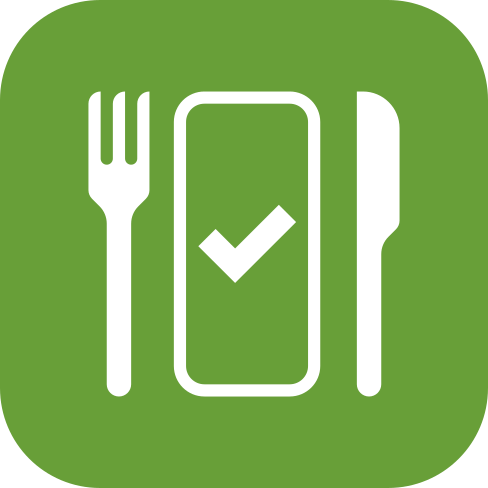
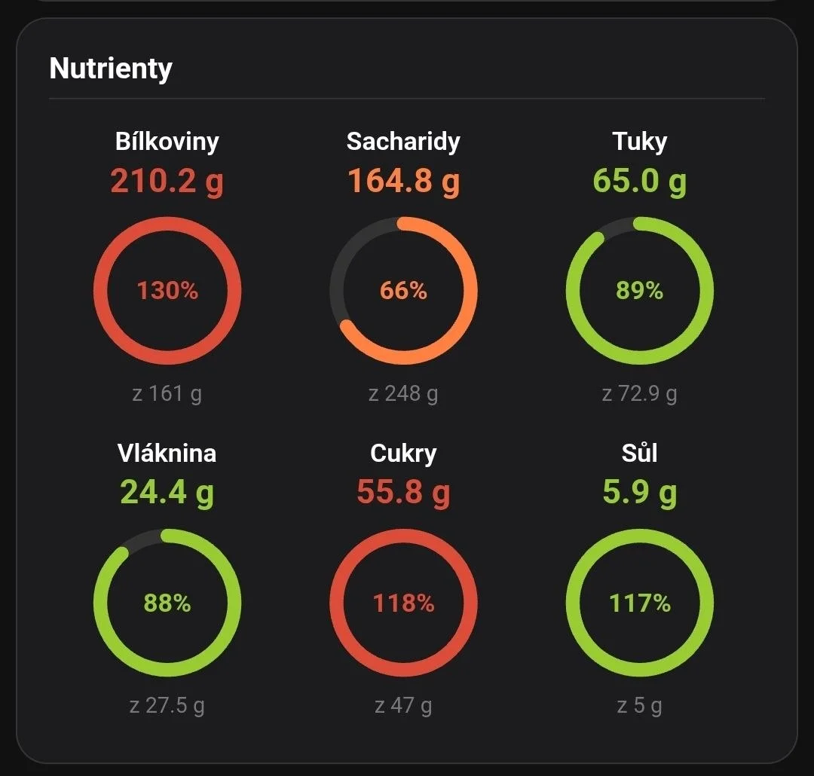
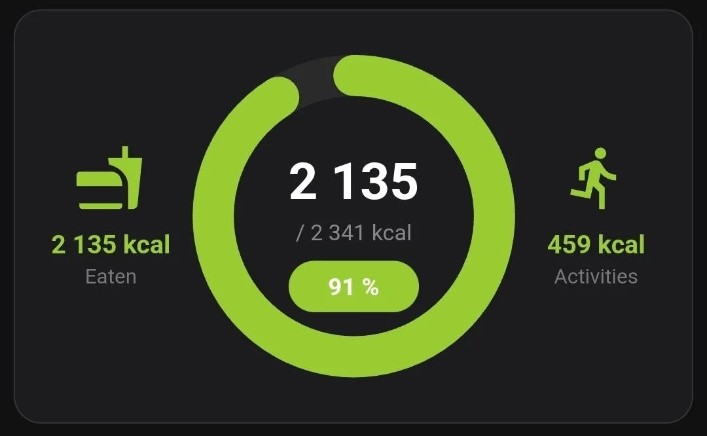

# Kaloricke Tabulky Home Assistant integration



[](https://my.home-assistant.io/redirect/hacs_repository/?owner=nikopol666&repository=homeassistant-kaloricke-tabulky&category=integration)

## Contents / Obsah

- [English](#english)
  - [What it does](#what-it-does)
  - [Sensors](#sensors)
  - [Lovelace nutrient card example](#lovelace-nutrient-card-example)
  - [Lovelace energy card example](#lovelace-energy-card-example)
  - [Installation](#installation)
  - [Actions](#actions)
  - [Notes](#notes)
- [Česky](#česky)
  - [Co integrace umí](#co-integrace-umí)
  - [Senzory](#senzory)
  - [Příklad Lovelace karty pro nutrienty](#příklad-lovelace-karty-pro-nutrienty)
  - [Příklad Lovelace karty pro energii](#příklad-lovelace-karty-pro-energii)
  - [Instalace](#instalace)
  - [Akce](#akce)
  - [Poznámky](#poznámky)

## English

Home Assistant custom integration for Kaloricke Tabulky.

### What it does

- Adds Kaloricke Tabulky through the Home Assistant UI.
- Asks for your email and password in the integration setup form.
- Creates sensors for weight, nutrition, water intake, activity energy and
  daily energy balance.
- Adds a `kaloricke_tabulky.record_weight` action for recording body weight.
- Adds `kaloricke_tabulky.search_food` and `kaloricke_tabulky.record_food`
  actions for searching and recording foods or drinks.
- Refreshes sensors every 240 minutes by default. This is intentionally gentle
  because the Kaloricke Tabulky API used by this integration is unofficial.
- Refreshes sensors immediately after `record_weight` or `record_food`
  succeeds.

You can change the refresh interval in the integration options. The minimum is
15 minutes.

### Sensors

The integration creates stable sensors for the useful values currently returned
by the Kaloricke Tabulky diary and weight endpoints.

| Sensor | Unit | Source |
| --- | --- | --- |
| Latest weight | kg | Latest record from the monthly weight endpoint |
| Energy | kcal | Daily intake total |
| Water | l | Drinking regime / water intake |
| Body weight | kg | Weight value in the daily diary summary |
| Protein | g | Daily protein total |
| Carbohydrates | g | Daily carbohydrate total |
| Fat | g | Daily fat total |
| Fiber | g | Daily fiber total |
| Sugar | g | Daily sugar total |
| Salt | g | Daily salt total |
| Activity energy | kcal | Energy from activities |
| Activity level energy | kcal | Activity level energy from the balance block |
| Energy output total | kcal | Total daily energy output |
| Maintenance intake | kcal | Maintenance energy intake |
| Energy deficit | kcal | Deficit or surplus reported by Kaloricke Tabulky |
| Energy target | kcal | Daily energy target |
| Basal metabolism | kcal | Basal metabolism |
| Energy remaining | kcal | Remaining energy intake |

Summary sensors expose these attributes when the API returns them:

- `goal`: the configured target for the metric.
- `percent`: current progress against the target.
- `source_key`: the raw metric key used by the API response.

`Latest weight` also exposes the latest date and the recent monthly weight
records as attributes.

When Kaloricke Tabulky starts returning another numeric metric with a clear
unit, the integration can expose it as an additional dynamic sensor.

Free accounts may return fewer nutrient cards from the diary summary endpoint
than Premium accounts. The integration therefore also reads the detailed diary
endpoint and fills missing nutrient totals from food rows when possible.

### Lovelace nutrient card example



The Kaloricke Tabulky web app does not use one universal color rule for every
nutrient. For example, low sugar can be good, while low fiber is not. This
example uses the same tolerance model as the web diary gauges:

- orange: below the green range.
- green: inside the metric-specific target range.
- red: above the green range.

Replace the entity IDs with your own sensor IDs.
Set `KT_MODE` to match the diary summary mode returned by Kaloricke Tabulky.
Known modes are `0` for stay fit, `1` for weight loss and `2` for muscle gain.
The example uses `0`, which matches the stay fit goal.

```yaml
type: custom:button-card
entity: sensor.kaloricke_tabulky_protein
show_name: false
show_icon: false
show_state: false
show_label: true
label: |
  [[[
    const NUTRIENTS = [
      { label: 'Protein',       entity: 'sensor.kaloricke_tabulky_protein',       key: 'protein' },
      { label: 'Carbohydrates', entity: 'sensor.kaloricke_tabulky_carbohydrates', key: 'carbohydrate' },
      { label: 'Fat',           entity: 'sensor.kaloricke_tabulky_fat',           key: 'fat' },
      { label: 'Fiber',         entity: 'sensor.kaloricke_tabulky_fiber',         key: 'fiber' },
      { label: 'Sugar',         entity: 'sensor.kaloricke_tabulky_sugar',         key: 'sugar' },
      { label: 'Salt',          entity: 'sensor.kaloricke_tabulky_salt',          key: 'salt' },
    ];

    const KT_MODE = 0;

    const THRESHOLDS = {
      0: {
        protein:      { low: 20,  high: 20 },
        carbohydrate: { low: 20,  high: 20 },
        fat:          { low: 20,  high: 20 },
        fiber:        { low: 20,  high: 30 },
        sugar:        { low: 100, high: 10 },
        salt:         { low: 40,  high: 80 },
      },
      1: {
        protein:      { low: 10,  high: 20 },
        carbohydrate: { low: 30,  high: 15 },
        fat:          { low: 30,  high: 15 },
        fiber:        { low: 20,  high: 30 },
        sugar:        { low: 100, high: 15 },
        salt:         { low: 40,  high: 80 },
      },
      2: {
        protein:      { low: 20,  high: 30 },
        carbohydrate: { low: 20,  high: 30 },
        fat:          { low: 30,  high: 20 },
        fiber:        { low: 20,  high: 30 },
        sugar:        { low: 100, high: 20 },
        salt:         { low: 40,  high: 80 },
      },
    };

    function parseKtNumber(value) {
      if (typeof value === 'number') return value;
      if (typeof value !== 'string') return NaN;
      return Number(value.replace(/\s/g, '').replace(',', '.'));
    }

    function percent(state) {
      const attrPercent = parseKtNumber(state.attributes.percent);
      if (Number.isFinite(attrPercent)) return Math.round(attrPercent);

      const value = parseKtNumber(state.state);
      const goal = parseKtNumber(state.attributes.goal);
      return Number.isFinite(goal) && goal > 0 ? Math.round((value / goal) * 100) : NaN;
    }

    function color(pct, key) {
      if (!Number.isFinite(pct)) return '#FF8040';
      const t = (THRESHOLDS[KT_MODE] || THRESHOLDS[0])[key] || { low: 20, high: 20 };
      if (pct < 100 - t.low) return '#FF8040';
      if (pct > 100 + t.high) return '#DD4B39';
      return '#99cc33';
    }

    function ring(pct, key, size) {
      const r = 34;
      const circ = 2 * Math.PI * r;
      const p = Number.isFinite(pct) ? Math.min(Math.max(pct, 0), 100) : 0;
      const dash = (p / 100) * circ;
      const c = color(pct, key);
      return `<svg width="${size}" height="${size}" viewBox="0 0 ${size} ${size}">
        <circle cx="${size / 2}" cy="${size / 2}" r="${r}" fill="none" stroke="#333" stroke-width="7"/>
        <circle cx="${size / 2}" cy="${size / 2}" r="${r}" fill="none" stroke="${c}" stroke-width="7"
          stroke-dasharray="${dash} ${circ}" stroke-linecap="round"
          transform="rotate(-90 ${size / 2} ${size / 2})"/>
        <text x="50%" y="55%" text-anchor="middle" fill="${c}" font-size="13" font-weight="bold">
          ${Number.isFinite(pct) ? pct + '%' : '?'}
        </text>
      </svg>`;
    }

    function tile(item) {
      const s = states[item.entity];
      if (!s) {
        return `<div style="width:33%;text-align:center;color:#e53935;padding:4px;font-size:11px">${item.label}<br>not found</div>`;
      }
      const value = parseKtNumber(s.state);
      const goal = parseKtNumber(s.attributes.goal);
      const pct = percent(s);
      const c = color(pct, item.key);
      const unit = s.attributes.unit_of_measurement || 'g';
      const fmt = v => Number.isFinite(v) ? (v % 1 === 0 ? v : v.toFixed(1)) : '?';
      return `<div style="width:33%;display:flex;flex-direction:column;align-items:center;padding:6px 0">
        <div style="font-weight:600;font-size:13px;margin-bottom:2px">${item.label}</div>
        <div style="color:${c};font-size:17px;font-weight:700;margin-bottom:2px">${fmt(value)} ${unit}</div>
        ${ring(pct, item.key, 88)}
        <div style="font-size:11px;color:#777;margin-top:2px">of ${fmt(goal)} ${unit}</div>
      </div>`;
    }

    const top = NUTRIENTS.slice(0, 3).map(tile).join('');
    const bottom = NUTRIENTS.slice(3).map(tile).join('');
    return `
      <div style="font-size:15px;font-weight:700;margin-bottom:8px;padding-bottom:6px;border-bottom:1px solid #333">Nutrients</div>
      <div style="display:flex">${top}</div>
      <div style="display:flex;margin-top:4px">${bottom}</div>
    `;
  ]]]
styles:
  card:
    - background: "#1c1c1e"
    - border-radius: 16px
    - padding: 16px
    - color: white
    - font-family: sans-serif
  label:
    - width: 100%
    - text-align: left
    - padding: 0
```

### Lovelace energy card example



The total energy gauge uses a different threshold model than nutrient gauges.
Kaloricke Tabulky uses green `85-115%` for stay fit and weight loss modes, and
green `90-120%` for muscle gain mode.

Replace the entity IDs with your own sensor IDs. Set `KT_MODE` to `0` for stay
fit, `1` for weight loss, or `2` for muscle gain.

```yaml
type: custom:button-card
entity: sensor.kaloricke_tabulky_energy
show_name: false
show_icon: false
show_state: false
show_label: true
label: |
  [[[
    const ENERGY_EATEN = 'sensor.kaloricke_tabulky_energy';
    const ENERGY_TARGET = 'sensor.kaloricke_tabulky_energy_target';
    const ACTIVITY_KCAL = 'sensor.kaloricke_tabulky_activity_level_energy';

    const KT_MODE = 0;

    function parseKtNumber(value) {
      if (typeof value === 'number') return value;
      if (typeof value !== 'string') return NaN;
      return Number(value.replace(/\s/g, '').replace(',', '.'));
    }

    function color(pct) {
      if (!Number.isFinite(pct)) return '#FF8040';
      const t = KT_MODE === 2 ? { low: 10, high: 20 } : { low: 15, high: 15 };
      if (pct < 100 - t.low) return '#FF8040';
      if (pct > 100 + t.high) return '#DD4B39';
      return '#99cc33';
    }

    const eaten = parseKtNumber(states[ENERGY_EATEN]?.state);
    const target = parseKtNumber(states[ENERGY_TARGET]?.state);
    const activity = parseKtNumber(states[ACTIVITY_KCAL]?.state);
    const pct = Number.isFinite(target) && target > 0
      ? Math.round((eaten / target) * 100)
      : NaN;
    const c = color(pct);
    const fmt = v => Number.isFinite(v)
      ? Math.round(v).toString().replace(/\B(?=(\d{3})+(?!\d))/g, '\u202f')
      : '?';

    const S = 200;
    const r = 82;
    const sw = 24;
    const circ = 2 * Math.PI * r;
    const dash = (Number.isFinite(pct) ? Math.min(Math.max(pct, 0), 100) : 0) / 100 * circ;
    const cx = S / 2;
    const cy = S / 2;
    const pillW = 76;
    const pillH = 30;

    const forkPath = 'M18.06 22.99h1.66c.84 0 1.53-.64 1.63-1.46L23 5.05h-5V1h-1.97v4.05h-4.97l.3 2.34c1.71.47 3.31 1.32 4.27 2.26 1.44 1.42 2.43 2.89 2.43 5.29v8.05zM1 21.99V21h15.03v.99c0 .55-.45 1-1.01 1H2.01c-.56 0-1.01-.45-1.01-1zm15.03-7c0-3.7-2.1-5.03-3.52-5.03H1.01C-.41 9.96.01 13.03 0 14.99h16.03z';
    const runPath = 'M13.49 5.48c1.1 0 2-.9 2-2s-.9-2-2-2-2 .9-2 2 .9 2 2 2zm-3.6 13.9l1-4.4 2.1 2v6h2v-7.5l-2.1-2 .6-3c1.3 1.5 3.3 2.5 5.5 2.5v-2c-1.9 0-3.5-1-4.3-2.4l-1-1.6c-.4-.6-1-1-1.7-1-.3 0-.5.1-.8.1l-5.2 2.2v4.7h2v-3.4l1.8-.7-1.6 8.1-4.9-1-.4 2 7 1.4z';
    const icon = p => `<svg width="40" height="40" viewBox="0 0 24 24" fill="${c}"><path d="${p}"/></svg>`;

    return `
      <div style="display:flex;align-items:center;justify-content:space-between;width:100%">
        <div style="display:flex;flex-direction:column;align-items:center;width:22%">
          ${icon(forkPath)}
          <div style="color:${c};font-size:15px;font-weight:700;margin-top:10px;text-align:center">${fmt(eaten)} kcal</div>
          <div style="color:#777;font-size:12px;margin-top:3px">Eaten</div>
        </div>

        <div style="width:56%;display:flex;justify-content:center">
          <svg width="${S}" height="${S}" viewBox="0 0 ${S} ${S}" style="max-width:100%">
            <circle cx="${cx}" cy="${cy}" r="${r}" fill="none" stroke="#2a2a2a" stroke-width="${sw}"/>
            <circle cx="${cx}" cy="${cy}" r="${r}" fill="none" stroke="${c}" stroke-width="${sw}"
              stroke-dasharray="${dash} ${circ}" stroke-linecap="round"
              transform="rotate(-90 ${cx} ${cy})"/>
            <text x="${cx}" y="${cy - 10}" text-anchor="middle"
              fill="white" font-size="30" font-weight="700" font-family="sans-serif">${fmt(eaten)}</text>
            <text x="${cx}" y="${cy + 14}" text-anchor="middle"
              fill="#888" font-size="13" font-family="sans-serif">/ ${fmt(target)} kcal</text>
            <rect x="${cx - pillW / 2}" y="${cy + 26}" width="${pillW}" height="${pillH}"
              rx="${pillH / 2}" fill="${c}"/>
            <text x="${cx}" y="${cy + 26 + pillH * 0.67}" text-anchor="middle"
              fill="white" font-size="14" font-weight="700" font-family="sans-serif">${Number.isFinite(pct) ? pct : '?'} %</text>
          </svg>
        </div>

        <div style="display:flex;flex-direction:column;align-items:center;width:22%">
          ${icon(runPath)}
          <div style="color:${c};font-size:15px;font-weight:700;margin-top:10px;text-align:center">${fmt(activity)} kcal</div>
          <div style="color:#777;font-size:12px;margin-top:3px">Activities</div>
        </div>
      </div>`;
  ]]]
styles:
  card:
    - background: "#1c1c1e"
    - border-radius: 16px
    - padding: 20px 16px
    - color: white
    - font-family: sans-serif
  label:
    - width: 100%
    - padding: 0
```

### Installation

#### HACS custom repository

Click the HACS button at the top of this README, then select **Download** in
HACS. After Home Assistant restarts, add the integration from
**Settings -> Devices & services -> Add integration**.

If the button does not work, add this repository manually in HACS:

```text
https://github.com/nikopol666/homeassistant-kaloricke-tabulky
```

Use **Integration** as the repository category.

#### Manual installation

1. Copy `custom_components/kaloricke_tabulky` into your Home Assistant
   `custom_components` directory.
2. Restart Home Assistant.
3. Go to **Settings -> Devices & services -> Add integration**.
4. Search for **Kaloricke Tabulky**.
5. Enter your Kaloricke Tabulky email and password in the form.

Home Assistant stores the credentials in its config entry storage. The
integration hashes the password with MD5 only when signing in, matching the
current Kaloricke Tabulky web endpoint behavior. You do not need to paste
browser cookies into Home Assistant.

### Actions

#### Record weight

```yaml
action: kaloricke_tabulky.record_weight
data:
  weight: 75.5
  date: "2026-05-12"
```

`date` is optional. If omitted, the integration records the weight for today.
Accepted date formats are `YYYY-MM-DD` and `DD.MM.YYYY`.

If you configure more than one Kaloricke Tabulky account, pass
`config_entry_id` to choose the account.

#### Search food or drinks

Use this action when you want to find the exact `food_guid` and available item
metadata before recording an item.

```yaml
action: kaloricke_tabulky.search_food
response_variable: kt_search
data:
  query: voda
  kind: drink
```

`kind` is either `food` or `drink`. Search results include `food_guid`, title,
unit, energy and brand metadata when Kaloricke Tabulky returns it.

#### Record food or drinks

You can record an item by `query` or by an exact `food_guid` returned from
`search_food`.

```yaml
action: kaloricke_tabulky.record_food
data:
  query: voda
  kind: drink
  amount: 250
  unit: ml
```

This records the first matching drink result, selects a matching unit option
when possible, and refreshes the sensors after the write succeeds.

```yaml
action: kaloricke_tabulky.record_food
data:
  food_guid: d10ffdda00be195b
  amount: 100
  unit: g
  date: "2026-05-12"
  time: "12:30"
  meal_type: lunch
```

`date` is optional and accepts `YYYY-MM-DD` or `DD.MM.YYYY`. `time` is optional
and defaults to the current Home Assistant time. If `meal_type` is omitted, the
integration assigns it from time:

| Time | Meal type |
| --- | --- |
| 05:00-09:59 | `breakfast` |
| 10:00-11:29 | `morning_snack` |
| 11:30-14:29 | `lunch` |
| 14:30-17:29 | `afternoon_snack` |
| 17:30-21:29 | `dinner` |
| 21:30-04:59 | `second_dinner` |

Supported explicit `meal_type` values are `breakfast`, `morning_snack`,
`lunch`, `afternoon_snack`, `dinner`, `second_dinner`, or numeric IDs `1`-`6`.
Advanced users can pass `unit_guid` directly from the Kaloricke Tabulky add
form; otherwise the integration tries to select a suitable unit from `amount`
and `unit`.

### Notes

This integration uses unofficial web endpoints from Kaloricke Tabulky and is
not affiliated with Kaloricke Tabulky. The endpoints can change without notice,
so API-related failures may need an integration update.

The repository includes local brand assets in
`custom_components/kaloricke_tabulky/brand/` so Home Assistant and HACS can show
the integration icon/logo without depending on an external image URL.

This project is released under the MIT License.

## Česky

Vlastní integrace Kalorické Tabulky pro Home Assistant.

### Co integrace umí

- Přidání Kalorických Tabulek přes UI Home Assistantu.
- Přihlašovací e-mail a heslo se zadávají ve formuláři při přidání integrace.
- Vytvoří senzory pro váhu, výživu, pitný režim, energii z aktivit a denní
  energetickou bilanci.
- Přidá akci `kaloricke_tabulky.record_weight` pro zápis tělesné váhy.
- Přidá akce `kaloricke_tabulky.search_food` a
  `kaloricke_tabulky.record_food` pro hledání a zápis jídla nebo pití.
- Výchozí obnova senzorů je každých 240 minut. Je to záměrně šetrné, protože
  API Kalorických Tabulek použité touto integrací je neoficiální.
- Po úspěšném zápisu váhy nebo jídla se senzory obnoví okamžitě.

Interval obnovy jde změnit v nastavení integrace. Minimum je 15 minut.

### Senzory

Integrace vytváří stabilní senzory pro užitečné hodnoty, které teď vrací deník
a endpoint s váhou.

| Senzor | Jednotka | Zdroj |
| --- | --- | --- |
| Poslední váha | kg | Poslední záznam z měsíčního endpointu váhy |
| Energie | kcal | Celkový denní příjem |
| Pitný režim | l | Denní příjem tekutin |
| Tělesná váha | kg | Hodnota váhy v denním souhrnu |
| Bílkoviny | g | Denní součet bílkovin |
| Sacharidy | g | Denní součet sacharidů |
| Tuky | g | Denní součet tuků |
| Vláknina | g | Denní součet vlákniny |
| Cukry | g | Denní součet cukrů |
| Sůl | g | Denní součet soli |
| Energie z aktivit | kcal | Energie z aktivit |
| Energie z denního režimu | kcal | Energie z denního režimu z bloku bilance |
| Celkový výdej energie | kcal | Celkový denní výdej energie |
| Udržovací příjem | kcal | Udržovací energetický příjem |
| Energetický deficit | kcal | Deficit nebo přebytek podle Kalorických Tabulek |
| Energetický cíl | kcal | Denní energetický cíl |
| Bazální metabolismus | kcal | Bazální metabolismus |
| Zbývající energie | kcal | Zbývající energetický příjem |

Souhrnné senzory mají tyto atributy, pokud je API vrátí:

- `goal`: nastavený cíl dané hodnoty.
- `percent`: aktuální plnění cíle v procentech.
- `source_key`: surový klíč hodnoty z API odpovědi.

`Poslední váha` navíc vrací v atributech datum posledního záznamu a nedávné
měsíční záznamy váhy.

Když Kalorické Tabulky začnou vracet další číselnou hodnotu s jasnou jednotkou,
integrace ji může zobrazit jako další dynamický senzor.

Bezplatné nebo demo účty můžou ze souhrnu deníku vracet méně nutrientů než Premium účty.
Integrace proto čte i detail deníku a pokud to jde, dopočítá chybějící součty
nutrientů z jednotlivých zapsaných potravin.

### Příklad Lovelace karty pro nutrienty


Web Kalorických Tabulek nepoužívá jedno univerzální pravidlo barvy pro všechny
nutrienty. Například nízké cukry můžou být v pořádku, ale nízká vláknina ne.
Tento příklad používá stejný toleranční model jako webové kruhové grafy v
deníku:

- oranžová: pod zeleným rozsahem.
- zelená: v cílovém rozsahu konkrétní metriky.
- červená: nad zeleným rozsahem.

Entity ID si nahraď podle svých senzorů.
`KT_MODE` nastav podle hodnoty `mode`, kterou vrací denní souhrn Kalorických
Tabulek. Známé režimy jsou `0` pro být fit, `1` pro hubnutí a `2` pro nabrat svaly.
Příklad používá `0`, což odpovídá cíli být fit.

```yaml
type: custom:button-card
entity: sensor.kaloricke_tabulky_protein
show_name: false
show_icon: false
show_state: false
show_label: true
label: |
  [[[
    const NUTRIENTS = [
      { label: 'Bílkoviny', entity: 'sensor.kaloricke_tabulky_protein',       key: 'protein' },
      { label: 'Sacharidy', entity: 'sensor.kaloricke_tabulky_carbohydrates', key: 'carbohydrate' },
      { label: 'Tuky',      entity: 'sensor.kaloricke_tabulky_fat',           key: 'fat' },
      { label: 'Vláknina',  entity: 'sensor.kaloricke_tabulky_fiber',         key: 'fiber' },
      { label: 'Cukry',     entity: 'sensor.kaloricke_tabulky_sugar',         key: 'sugar' },
      { label: 'Sůl',       entity: 'sensor.kaloricke_tabulky_salt',          key: 'salt' },
    ];

    const KT_MODE = 0;

    const THRESHOLDS = {
      0: {
        protein:      { low: 20,  high: 20 },
        carbohydrate: { low: 20,  high: 20 },
        fat:          { low: 20,  high: 20 },
        fiber:        { low: 20,  high: 30 },
        sugar:        { low: 100, high: 10 },
        salt:         { low: 40,  high: 80 },
      },
      1: {
        protein:      { low: 10,  high: 20 },
        carbohydrate: { low: 30,  high: 15 },
        fat:          { low: 30,  high: 15 },
        fiber:        { low: 20,  high: 30 },
        sugar:        { low: 100, high: 15 },
        salt:         { low: 40,  high: 80 },
      },
      2: {
        protein:      { low: 20,  high: 30 },
        carbohydrate: { low: 20,  high: 30 },
        fat:          { low: 30,  high: 20 },
        fiber:        { low: 20,  high: 30 },
        sugar:        { low: 100, high: 20 },
        salt:         { low: 40,  high: 80 },
      },
    };

    function parseKtNumber(value) {
      if (typeof value === 'number') return value;
      if (typeof value !== 'string') return NaN;
      return Number(value.replace(/\s/g, '').replace(',', '.'));
    }

    function percent(state) {
      const attrPercent = parseKtNumber(state.attributes.percent);
      if (Number.isFinite(attrPercent)) return Math.round(attrPercent);

      const value = parseKtNumber(state.state);
      const goal = parseKtNumber(state.attributes.goal);
      return Number.isFinite(goal) && goal > 0 ? Math.round((value / goal) * 100) : NaN;
    }

    function color(pct, key) {
      if (!Number.isFinite(pct)) return '#FF8040';
      const t = (THRESHOLDS[KT_MODE] || THRESHOLDS[0])[key] || { low: 20, high: 20 };
      if (pct < 100 - t.low) return '#FF8040';
      if (pct > 100 + t.high) return '#DD4B39';
      return '#99cc33';
    }

    function ring(pct, key, size) {
      const r = 34;
      const circ = 2 * Math.PI * r;
      const p = Number.isFinite(pct) ? Math.min(Math.max(pct, 0), 100) : 0;
      const dash = (p / 100) * circ;
      const c = color(pct, key);
      return `<svg width="${size}" height="${size}" viewBox="0 0 ${size} ${size}">
        <circle cx="${size / 2}" cy="${size / 2}" r="${r}" fill="none" stroke="#333" stroke-width="7"/>
        <circle cx="${size / 2}" cy="${size / 2}" r="${r}" fill="none" stroke="${c}" stroke-width="7"
          stroke-dasharray="${dash} ${circ}" stroke-linecap="round"
          transform="rotate(-90 ${size / 2} ${size / 2})"/>
        <text x="50%" y="55%" text-anchor="middle" fill="${c}" font-size="13" font-weight="bold">
          ${Number.isFinite(pct) ? pct + '%' : '?'}
        </text>
      </svg>`;
    }

    function tile(item) {
      const s = states[item.entity];
      if (!s) {
        return `<div style="width:33%;text-align:center;color:#e53935;padding:4px;font-size:11px">${item.label}<br>nenalezeno</div>`;
      }
      const value = parseKtNumber(s.state);
      const goal = parseKtNumber(s.attributes.goal);
      const pct = percent(s);
      const c = color(pct, item.key);
      const unit = s.attributes.unit_of_measurement || 'g';
      const fmt = v => Number.isFinite(v) ? (v % 1 === 0 ? v : v.toFixed(1)) : '?';
      return `<div style="width:33%;display:flex;flex-direction:column;align-items:center;padding:6px 0">
        <div style="font-weight:600;font-size:13px;margin-bottom:2px">${item.label}</div>
        <div style="color:${c};font-size:17px;font-weight:700;margin-bottom:2px">${fmt(value)} ${unit}</div>
        ${ring(pct, item.key, 88)}
        <div style="font-size:11px;color:#777;margin-top:2px">z ${fmt(goal)} ${unit}</div>
      </div>`;
    }

    const top = NUTRIENTS.slice(0, 3).map(tile).join('');
    const bottom = NUTRIENTS.slice(3).map(tile).join('');
    return `
      <div style="font-size:15px;font-weight:700;margin-bottom:8px;padding-bottom:6px;border-bottom:1px solid #333">Nutrienty</div>
      <div style="display:flex">${top}</div>
      <div style="display:flex;margin-top:4px">${bottom}</div>
    `;
  ]]]
styles:
  card:
    - background: "#1c1c1e"
    - border-radius: 16px
    - padding: 16px
    - color: white
    - font-family: sans-serif
  label:
    - width: 100%
    - text-align: left
    - padding: 0
```

### Příklad Lovelace karty pro energii


Celková energie používá jiné prahy než nutrienty. Kalorické Tabulky používají
zelený rozsah `85-115 %` pro režimy být fit a hubnutí, a zelený rozsah
`90-120 %` pro režim nabrat svaly.

Entity ID si nahraď podle svých senzorů. `KT_MODE` nastav na `0` pro být fit,
`1` pro hubnutí, nebo `2` pro nabrat svaly.

```yaml
type: custom:button-card
entity: sensor.kaloricke_tabulky_energy
show_name: false
show_icon: false
show_state: false
show_label: true
label: |
  [[[
    const ENERGY_EATEN = 'sensor.kaloricke_tabulky_energy';
    const ENERGY_TARGET = 'sensor.kaloricke_tabulky_energy_target';
    const ACTIVITY_KCAL = 'sensor.kaloricke_tabulky_activity_level_energy';

    const KT_MODE = 0;

    function parseKtNumber(value) {
      if (typeof value === 'number') return value;
      if (typeof value !== 'string') return NaN;
      return Number(value.replace(/\s/g, '').replace(',', '.'));
    }

    function color(pct) {
      if (!Number.isFinite(pct)) return '#FF8040';
      const t = KT_MODE === 2 ? { low: 10, high: 20 } : { low: 15, high: 15 };
      if (pct < 100 - t.low) return '#FF8040';
      if (pct > 100 + t.high) return '#DD4B39';
      return '#99cc33';
    }

    const eaten = parseKtNumber(states[ENERGY_EATEN]?.state);
    const target = parseKtNumber(states[ENERGY_TARGET]?.state);
    const activity = parseKtNumber(states[ACTIVITY_KCAL]?.state);
    const pct = Number.isFinite(target) && target > 0
      ? Math.round((eaten / target) * 100)
      : NaN;
    const c = color(pct);
    const fmt = v => Number.isFinite(v)
      ? Math.round(v).toString().replace(/\B(?=(\d{3})+(?!\d))/g, '\u202f')
      : '?';

    const S = 200;
    const r = 82;
    const sw = 24;
    const circ = 2 * Math.PI * r;
    const dash = (Number.isFinite(pct) ? Math.min(Math.max(pct, 0), 100) : 0) / 100 * circ;
    const cx = S / 2;
    const cy = S / 2;
    const pillW = 76;
    const pillH = 30;

    const forkPath = 'M18.06 22.99h1.66c.84 0 1.53-.64 1.63-1.46L23 5.05h-5V1h-1.97v4.05h-4.97l.3 2.34c1.71.47 3.31 1.32 4.27 2.26 1.44 1.42 2.43 2.89 2.43 5.29v8.05zM1 21.99V21h15.03v.99c0 .55-.45 1-1.01 1H2.01c-.56 0-1.01-.45-1.01-1zm15.03-7c0-3.7-2.1-5.03-3.52-5.03H1.01C-.41 9.96.01 13.03 0 14.99h16.03z';
    const runPath = 'M13.49 5.48c1.1 0 2-.9 2-2s-.9-2-2-2-2 .9-2 2 .9 2 2 2zm-3.6 13.9l1-4.4 2.1 2v6h2v-7.5l-2.1-2 .6-3c1.3 1.5 3.3 2.5 5.5 2.5v-2c-1.9 0-3.5-1-4.3-2.4l-1-1.6c-.4-.6-1-1-1.7-1-.3 0-.5.1-.8.1l-5.2 2.2v4.7h2v-3.4l1.8-.7-1.6 8.1-4.9-1-.4 2 7 1.4z';
    const icon = p => `<svg width="40" height="40" viewBox="0 0 24 24" fill="${c}"><path d="${p}"/></svg>`;

    return `
      <div style="display:flex;align-items:center;justify-content:space-between;width:100%">
        <div style="display:flex;flex-direction:column;align-items:center;width:22%">
          ${icon(forkPath)}
          <div style="color:${c};font-size:15px;font-weight:700;margin-top:10px;text-align:center">${fmt(eaten)} kcal</div>
          <div style="color:#777;font-size:12px;margin-top:3px">Snědeno</div>
        </div>

        <div style="width:56%;display:flex;justify-content:center">
          <svg width="${S}" height="${S}" viewBox="0 0 ${S} ${S}" style="max-width:100%">
            <circle cx="${cx}" cy="${cy}" r="${r}" fill="none" stroke="#2a2a2a" stroke-width="${sw}"/>
            <circle cx="${cx}" cy="${cy}" r="${r}" fill="none" stroke="${c}" stroke-width="${sw}"
              stroke-dasharray="${dash} ${circ}" stroke-linecap="round"
              transform="rotate(-90 ${cx} ${cy})"/>
            <text x="${cx}" y="${cy - 10}" text-anchor="middle"
              fill="white" font-size="30" font-weight="700" font-family="sans-serif">${fmt(eaten)}</text>
            <text x="${cx}" y="${cy + 14}" text-anchor="middle"
              fill="#888" font-size="13" font-family="sans-serif">/ ${fmt(target)} kcal</text>
            <rect x="${cx - pillW / 2}" y="${cy + 26}" width="${pillW}" height="${pillH}"
              rx="${pillH / 2}" fill="${c}"/>
            <text x="${cx}" y="${cy + 26 + pillH * 0.67}" text-anchor="middle"
              fill="white" font-size="14" font-weight="700" font-family="sans-serif">${Number.isFinite(pct) ? pct : '?'} %</text>
          </svg>
        </div>

        <div style="display:flex;flex-direction:column;align-items:center;width:22%">
          ${icon(runPath)}
          <div style="color:${c};font-size:15px;font-weight:700;margin-top:10px;text-align:center">${fmt(activity)} kcal</div>
          <div style="color:#777;font-size:12px;margin-top:3px">Aktivity</div>
        </div>
      </div>`;
  ]]]
styles:
  card:
    - background: "#1c1c1e"
    - border-radius: 16px
    - padding: 20px 16px
    - color: white
    - font-family: sans-serif
  label:
    - width: 100%
    - padding: 0
```

### Instalace

#### HACS custom repository

Klikni na HACS tlačítko nahoře v README a potom v HACS zvol **Download**. Po
restartu Home Assistantu přidej integraci přes **Nastavení -> Zařízení a služby
-> Přidat integraci**.

Když tlačítko nefunguje, přidej repozitář do HACS ručně:

```text
https://github.com/nikopol666/homeassistant-kaloricke-tabulky
```

Kategorie repozitáře je **Integration**.

#### Ruční instalace

1. Zkopíruj `custom_components/kaloricke_tabulky` do adresáře
   `custom_components` v Home Assistantu.
2. Restartuj Home Assistant.
3. Otevři **Nastavení -> Zařízení a služby -> Přidat integraci**.
4. Vyhledej **Kaloricke Tabulky**.
5. Do formuláře zadej svůj e-mail a heslo ke Kalorickým Tabulkám.

Home Assistant uloží údaje do svého config entry úložiště. Integrace heslo
zahashuje pomocí MD5 až při přihlášení, stejně jako současný webový endpoint
Kalorických Tabulek. Cookies z prohlížeče není potřeba do Home Assistantu
kopírovat.

### Akce

#### Zapsat váhu

```yaml
action: kaloricke_tabulky.record_weight
data:
  weight: 75.5
  date: "2026-05-12"
```

`date` je volitelné. Když ho nevyplníš, integrace zapíše váhu pro dnešní den.
Podporované formáty data jsou `YYYY-MM-DD` a `DD.MM.YYYY`.

Pokud máš nastavený více než jeden účet Kalorických Tabulek, přidej
`config_entry_id`, aby bylo jasné, do kterého účtu se má váha zapsat.

#### Hledat jídlo nebo pití

Tahle akce se hodí, když chceš nejdřív najít přesné `food_guid` a metadata
položky před zápisem.

```yaml
action: kaloricke_tabulky.search_food
response_variable: kt_search
data:
  query: voda
  kind: drink
```

`kind` je buď `food`, nebo `drink`. Výsledky obsahují `food_guid`, název,
jednotku, energii a metadata značky, pokud je Kalorické Tabulky vrátí.

#### Zapsat jídlo nebo pití

Položku můžeš zapsat přes `query`, nebo přes přesné `food_guid` vrácené akcí
`search_food`.

```yaml
action: kaloricke_tabulky.record_food
data:
  query: voda
  kind: drink
  amount: 250
  unit: ml
```

Tohle zapíše první nalezený nápoj, pokud to jde vybere odpovídající jednotku a
po úspěšném zápisu obnoví senzory.

```yaml
action: kaloricke_tabulky.record_food
data:
  food_guid: d10ffdda00be195b
  amount: 100
  unit: g
  date: "2026-05-12"
  time: "12:30"
  meal_type: lunch
```

`date` je volitelné a podporuje `YYYY-MM-DD` nebo `DD.MM.YYYY`. `time` je
volitelné a výchozí hodnota je aktuální čas Home Assistantu. Pokud nevyplníš
`meal_type`, integrace ho přiřadí podle času:

| Čas | Typ jídla |
| --- | --- |
| 05:00-09:59 | `breakfast` |
| 10:00-11:29 | `morning_snack` |
| 11:30-14:29 | `lunch` |
| 14:30-17:29 | `afternoon_snack` |
| 17:30-21:29 | `dinner` |
| 21:30-04:59 | `second_dinner` |

Podporované ruční hodnoty `meal_type` jsou `breakfast`, `morning_snack`,
`lunch`, `afternoon_snack`, `dinner`, `second_dinner`, nebo číselná ID `1`-`6`.
Pokročile můžeš poslat přímo `unit_guid` z formuláře Kalorických Tabulek;
jinak se integrace pokusí vybrat vhodnou jednotku podle `amount` a `unit`.

### Poznámky

Integrace používá neoficiální webové endpointy Kalorických Tabulek a není s
Kalorickými Tabulkami nijak afiliovaná. Endpointy se můžou změnit bez
upozornění, takže případné API chyby můžou vyžadovat úpravu integrace.

Repozitář obsahuje lokální brand assety v
`custom_components/kaloricke_tabulky/brand/`, aby Home Assistant a HACS mohly
zobrazit ikonu/logo integrace bez závislosti na externí URL.

Projekt je vydaný pod licencí MIT.
